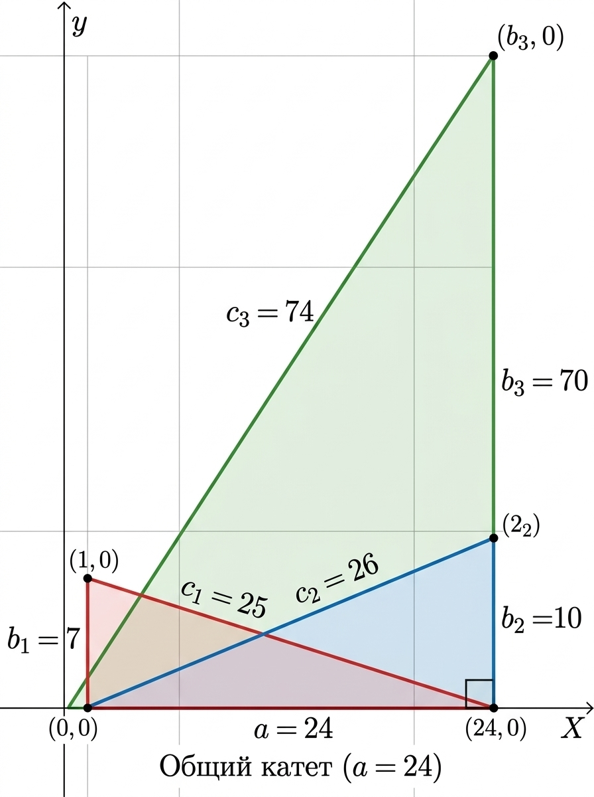

# Триокатт / Triocatt

**Триокатт (Triocatt)** — это составная геометрическая структура, состоящая из трех независимых прямоугольных (пифагоровых) треугольников с целочисленными сторонами, объединенных вокруг одного общего неделимого катета.

*Etymology / Этимология:*
*   **RU:** Название образовано от **Трио** + **3 ОКат** (**3** **О**динаковых **Кат**ета треугольников).
*   **EN:** The name is derived from **Trio** + **3 I.Cat.** (**3** **I**dentical **Cat**heti of triangles).

---

## 🛠️ Анатомия и правила сборки структуры / Structure Anatomy

Структура Триокатт состоит из **7 элементов (параметров)**: одного базового (общего) и шести уникальных (производных).

1. **Базис (Общий катет $a$):** Фундамент структуры. Единый отрезок, который одновременно является катетом для всех трех треугольников.
2. **Ортогональные лучи (Вторые катеты $b_1, b_2, b_3$):** Три уникальных целочисленных отрезка. Каждый из них расположен под углом 90° к базису $a$.
3. **Замыкающие векторы (Гипотенузы $c_1, c_2, c_3$):** Три уникальных целочисленных отрезка, соединяющих концы базиса и ортогональных лучей.

### Математические критерии сборки:
* Все 7 отрезков структуры должны быть строго **натуральными числами** ($\mathbb{Z}^+$).
* Вторые катеты уникальны и не равны друг другу: $b_1 \neq b_2 \neq b_3$.
* Гипотенузы уникальны и не равны друг другу: $c_1 \neq c_2 \neq c_3$.

$$
\begin{cases}
a^2 + b_1^2 = c_1^2 \\
a^2 + b_2^2 = c_2^2 \\
a^2 + b_3^2 = c_3^2
\end{cases}
$$

---

## 💎 Базовый эталон структуры (Триокатт)

Наименьшим возможным Триокаттом в математике является структура с базисом **$a = 24$**. Она состоит из следующих трех пифагоровых треугольников:

### 1. Элемент «Альфа»
*   **Базис ($a$):** 24
*   **Второй катет ($b_1$):** 7
*   **Гипотенуза ($c_1$):** 25
*   *Формула:* $24^2 + 7^2 = 25^2 \implies 576 + 49 = 625$

### 2. Элемент «Бета»
*   **Базис ($a$):** 24
*   **Второй катет ($b_2$):** 10
*   **Гипотенуза ($c_2$):** 26
*   *Формула:* $24^2 + 10^2 = 26^2 \implies 576 + 100 = 676$

### 3. Элемент «Гамма»
*   **Базис ($a$):** 24
*   **Второй катет ($b_3$):** 70
*   **Гипотенуза ($c_3$):** 74
*   *Формула:* $24^2 + 70^2 = 74^2 \implies 576 + 4900 = 5476$

---

## 📐 Визуализация структуры / Geometric Layout

---

## 📜 License / Лицензия
This terminology and concept are published under the **Creative Commons Attribution 4.0 International (CC BY 4.0)** license.
